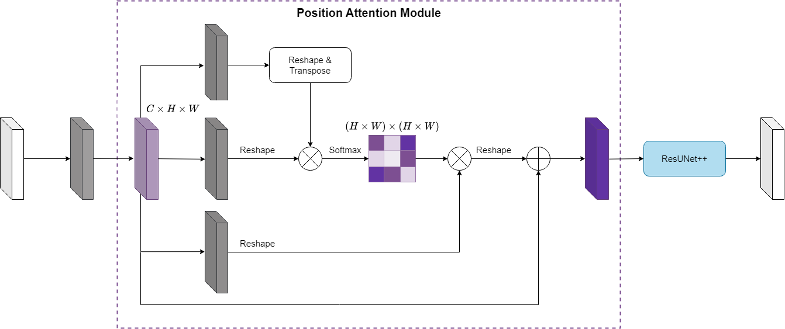
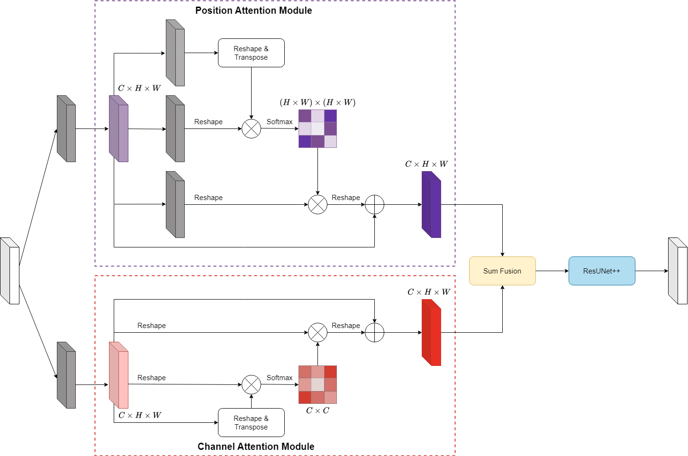
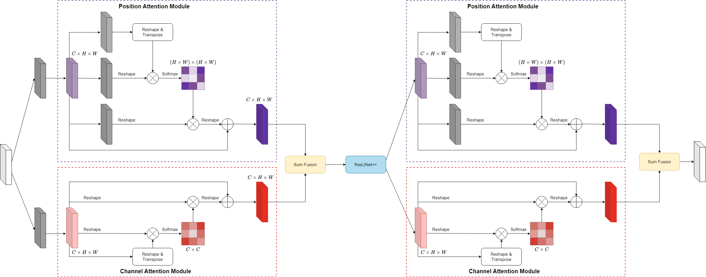

# Advancing precision in endoscopic surgery: a novel approach with attention mechanisms and adaptive threshold for surgical instrument segmentation

## Proposed architectures

### PAM-ResUNet++

### DA-ResUNet++

### DoubleDA-ResUNet++

## Datasets:

- **Kvasir Instrument**:
  - Website to the original dataset: https://datasets.simula.no/kvasir-instrument
- **Rigid Instruments**:
  - Website to the original dataset: https://opencas.webarchiv.kit.edu/?q=node/30
- **Endoscopic** :
  - Website to the original dataset: https://opencas.webarchiv.kit.edu/?q=InstrumentCrowd

## Benchmark

### Experiment results of proposed models

|             Method              | Kvasir Instrument |       | Rigid Instruments |       | Endoscopic |       |
| :-----------------------------: | :---------------: | :---: | :---------------: | :---: | :--------: | :---: |
|                                 |       **Dice**        |  **IoU**  |       **Dice**        |  **IoU**  |    **Dice**    |  **IoU**  |
| DA-ResUNet++ + Otsu's threshold |       0.962       | 0.912 |       0.901       | 0.830 |   0.910    | 0.813 |

### Comparison with other methods on Kvasir Instrument dataset

|     Method      | Dice  |  IoU  |
| :-------------: | :---: | :---: |
|      U-Net      | 0.908 | 0.863 |
|    TerausNet    | 0.916 | 0.853 |
|     U-Net++     | 0.927 | 0.892 |
| Attention U-Net | 0.926 | 0.891 |
|    MSRF-Net     | 0.937 | 0.899 |
|   DoubleUNet    | 0.903 | 0.843 |
|     RASNet      | 0.954 | 0.925 |
|   Deeplabv3+    | 0.907 | 0.863 |
|     NanoNet     | 0.928 | 0.879 |
|    SurgiNet     | 0.949 | 0.917 |
|     PAANet      | 0.949 | 0.916 |
|   UNet + DAM    | 0.957 | 0.921 |
|    **Ours**     | 0.962 | 0.912 |

### Comparison with other methods on Rigid Instruments dataset

|     Method      | Dice  |  IoU  |
| :-------------: | :---: | :---: |
|     FCN-8s      | 0.788 | 0.510 |
|     FCN-16s     | 0.822 | 0.698 |
|     FCN-32s     | 0.716 | 0.558 |
|      M-Net      | 0.772 | 0.670 |
|    M-Net 51     | 0.871 | 0.771 |
|     PSPNet      | 0.606 | 0.435 |
|    DeepLabv3    | 0.665 | 0.498 |
| Attention U-Net | 0.813 | 0.686 |
|   U-Net + DFP   | 0.899 | 0.817 |
|    **Ours**     | 0.901 | 0.830 |
